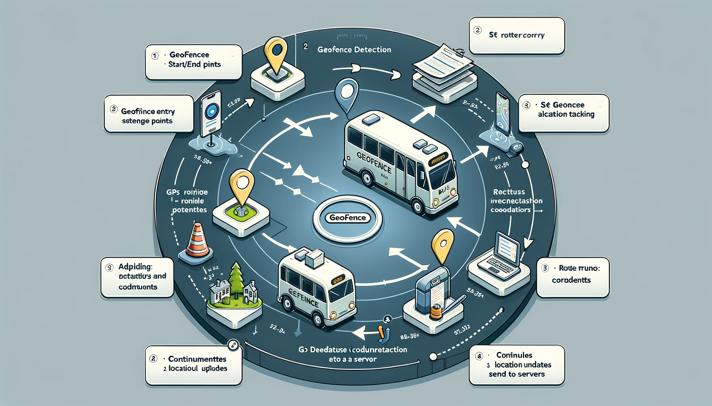

# GPS Route Tracking System

This project includes a GPS route tracking system using React Native, EMQX (MQTT broker), MongoDB, and FastAPI. The system architecture involves:

1. **React Native Application**: Sends current location data through MQTT every second.
2. **EMQX (MQTT Broker)**: Handles real-time MQTT messages.
3. **MongoDB**: Stores route location data.
4. **Data Ingestion Microservice**: Subscribes to the MQTT topic and stores the received data in MongoDB.
5. **FastAPI Microservice**: Provides an API to access stored route data.

## Components

1. **EMQX Broker**: An open-source MQTT broker, handling the messaging queue.
2. **MongoDB**: A NoSQL database used for efficient storage and retrieval of location data.
3. **React Native Application**: A mobile application to send location data.
4. **Data Ingestion Service**: A backend service to process and store incoming MQTT messages in MongoDB.
5. **FastAPI Service**: A Python-based API service to fetch and serve stored route data.

## Setup and Installation

### Prerequisites

- Docker and Docker Compose
- Node.js and npm (for React Native app)
- Python (for FastAPI service)

### Running the Services

1. **Start EMQX and MongoDB**:
   Use `docker-compose up` to start the EMQX broker and MongoDB.

2. **Configure React Native Application**:
   - Update the MQTT server details in the application configuration.
   - Run the app on a physical device or emulator.

3. **Start Data Ingestion Microservice**:
   - Ensure it's configured to connect to both MongoDB and the MQTT broker.
   - Run the service to start listening for MQTT messages.

4. **Start FastAPI Service**:
   - Configure MongoDB connection details.
   - Run the FastAPI server.

### Services URLs

- **EMQX Dashboard**: <http://localhost:18083>
- **FastAPI Swagger UI**: <http://localhost:8000/docs>

## Architecture Diagram

(Include a system architecture diagram if available)

## API Documentation

(Include API endpoints and usage details)

## Future Enhancements

I dunno :)

