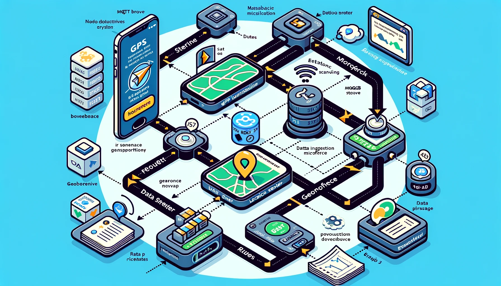

# Workflow Overview

## 1. React Native Application (Location Sender)

- **Function**: Sends real-time GPS location data of bus drivers.
- **Operation**:
  - Detects when a bus enters a predefined geofence, signaling the start of a new route.
  - Continuously sends location data to the MQTT broker every second.
  - Detects when the bus re-enters the geofence, marking the end of the route.

## 2. EMQX (MQTT Broker)

- **Function**: Manages real-time MQTT messages from the React Native application.
- **Operation**:
  - Receives location data messages.
  - Passes messages to the Data Ingestion Microservice.

## 3. Data Ingestion Microservice (Python-based)

- **Function**: Processes incoming MQTT messages and stores them in MongoDB.
- **Operation**:
  - Subscribes to the MQTT topic to receive location data.
  - Determines if a new route needs to be created or if the data belongs to an ongoing trip.
  - Stores the data in the appropriate `routes` or `trips` collection in MongoDB.

## 4. MongoDB Database

- **Collections**:
  - `routes`: Stores static information about each route (path, expected time, etc.).
  - `trips`: Stores dynamic data about individual trips (start time, end time, actual path, etc.).
- **Operation**:
  - New route data is added to the `routes` collection when a unique route is identified.
  - Trip data is appended to the `trips` collection, referencing the corresponding route ID.

## 5. FastAPI Microservice

- **Function**: Provides an API for accessing stored route and trip data.
- **Operation**:
  - Fetches data from MongoDB upon API requests.
  - Offers endpoints for retrieving route details, trip information, and historical data.

## Detailed Steps

1. **Start of Route**:
   - The bus driver starts the React Native app upon beginning their route.
   - The app detects entry into the start geofence and begins sending location data to EMQX.

2. **Data Transmission**:
   - Location data, including coordinates and timestamps, is sent to EMQX, which forwards it to the Data Ingestion Microservice.

3. **Data Processing and Storage**:
   - The Data Ingestion Microservice processes each received message.
   - If a new route is detected (based on geofence entry), a new document is created in the `routes` collection.
   - Location data is stored in the `trips` collection, referencing the current route.

4. **End of Route**:
   - Upon re-entry into the geofence, the app signals the end of the route.
   - The trip document is updated with the end time and other relevant data.

5. **Data Access and Visualization**:
   - The FastAPI Microservice provides endpoints to access route and trip data.
   - This data can be used for real-time monitoring, historical analysis, and route optimization.

6. **Machine Learning and Analytics** (Future Scope):
   - Historical route and trip data can be used to train ML models for anomaly detection and route optimization.
   - Regular updates to ML models ensure they adapt to new patterns and changes in route dynamics.

## Conclusion

This workflow provides a comprehensive system for real-time GPS route tracking, data processing, storage, and retrieval. It's designed to minimize manual input, automate route and trip data collection, and provide a platform for advanced analytics and optimizations.
